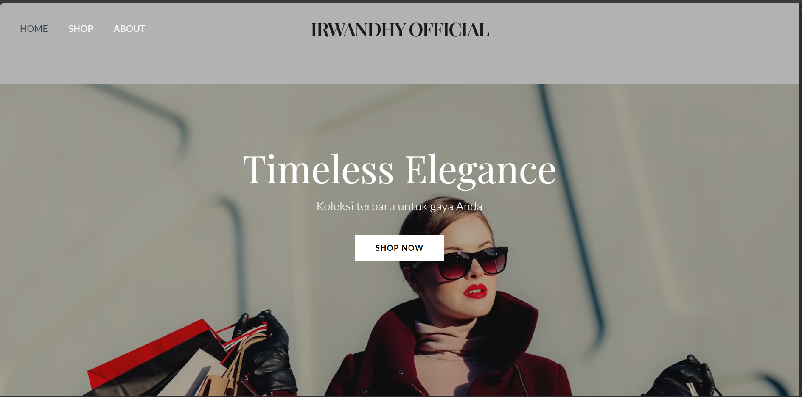
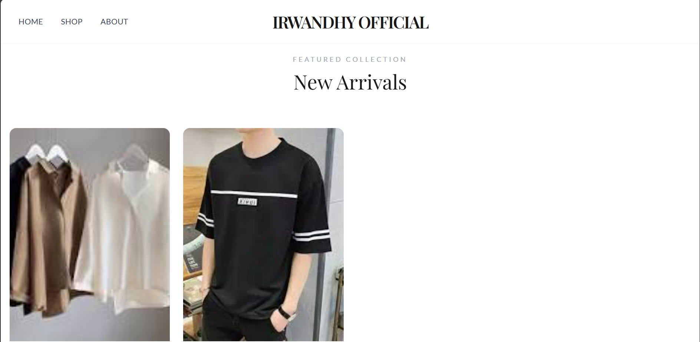
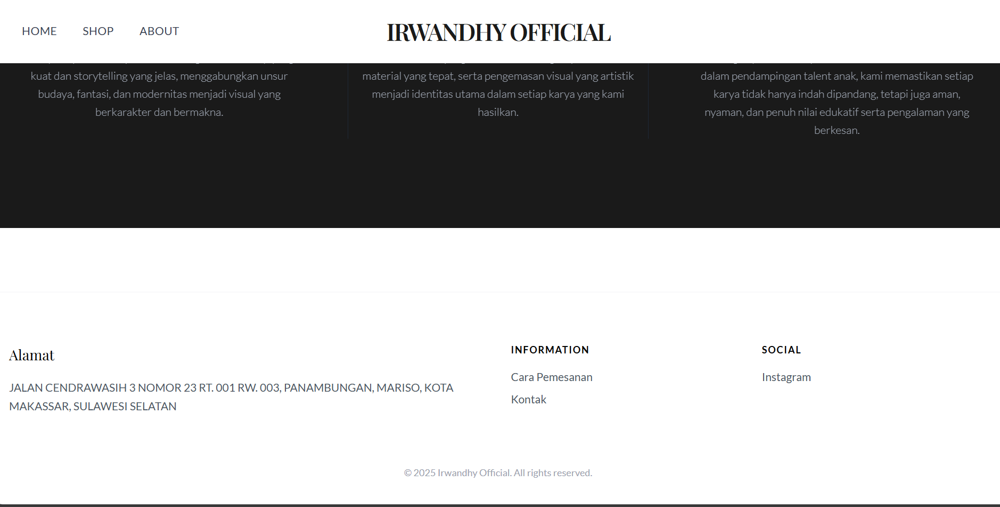
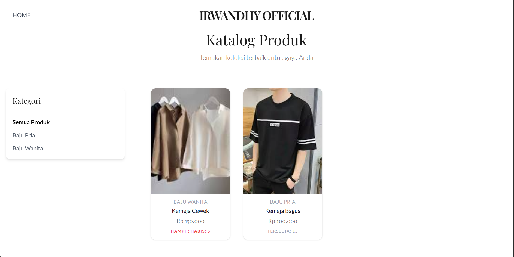
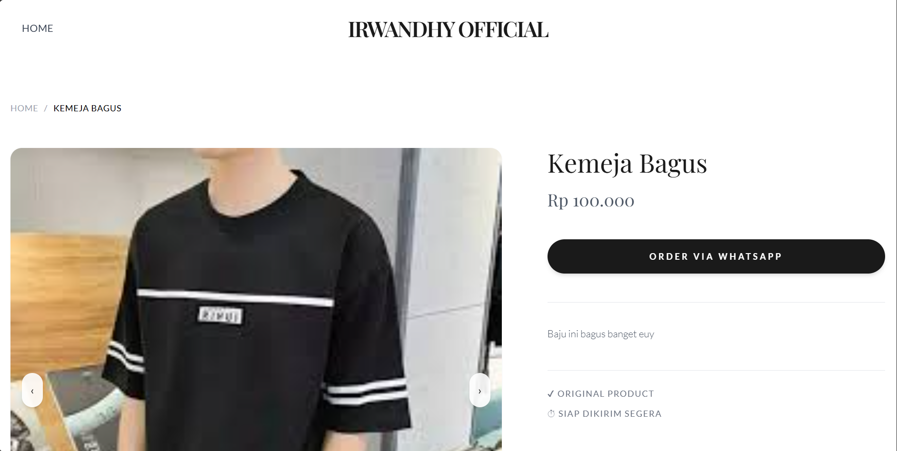
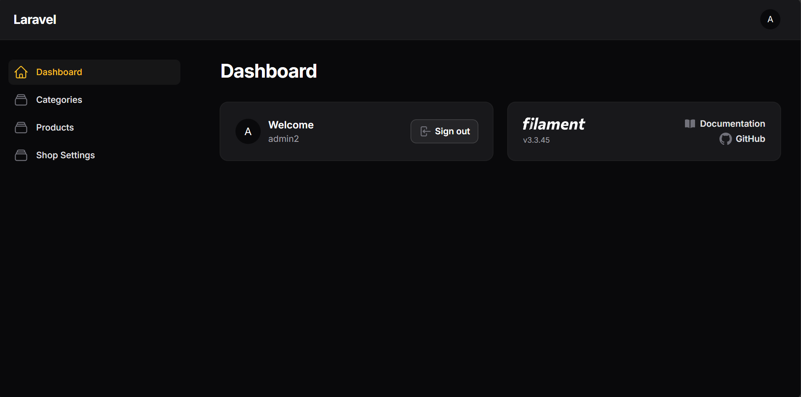

# 🛍️ Website Katalog Produk (Laravel + Filament)


Sebuah aplikasi **Website Katalog Produk** modern yang dirancang untuk menampilkan produk-produk unggulan Anda dengan tampilan yang elegan. Dibangun menggunakan framework **Laravel** yang kuat dan panel admin **Filament** yang memudahkan pengelolaan konten tanpa perlu menyentuh kode.

---

## ✨ Fitur Utama

### 🖥️ Halaman Publik (Frontend)
* **Beranda Menarik**: Tampilan awal yang responsif dan modern.
* **Katalog Produk**: Menampilkan daftar produk dengan filter kategori.
* **Detail Produk**: Halaman detail lengkap dengan deskripsi, harga, dan spesifikasi produk.
* **Informasi Toko**: Menampilkan informasi kontak dan detail toko yang dinamis.

### ⚙️ Panel Admin (Filament)
* **Dashboard Interaktif**: Ringkasan data produk dan kategori.
* **Manajemen Kategori**: Buat, ubah, dan hapus kategori produk dengan mudah.
* **Manajemen Produk**: Upload gambar, atur harga, stok, dan deskripsi produk (Rich Text Editor).
* **Pengaturan Toko (Shop Settings)**: Ubah nama toko, alamat, kontak, dan logo langsung dari admin panel.

---

## 🛠️ Teknologi yang Digunakan

* **Backend Framework**: [Laravel 11](https://laravel.com/)
* **Admin Panel**: [Filament PHP](https://filamentphp.com/)
* **Frontend Styling**: [Tailwind CSS](https://tailwindcss.com/)
* **Database**: MySQL 

---

## 📸 Tangkapan Layar (Screenshots)

### Hero Section


### New Arrivals


### About


### Footer


### Katalog


### Detail Produk


### Admin Panel


---

## 🚀 Cara Instalasi

Ikuti langkah-langkah berikut untuk menjalankan proyek ini di komputer lokal Anda:

### Prasyarat
Pastikan Anda telah menginstal:
* PHP >= 8.2
* Composer

### Langkah-langkah

1.  **Clone Repositori**
    ```bash
    git clone [https://github.com/username-anda/website-katalog.git](https://github.com/username-anda/website-katalog.git)
    cd website-katalog
    ```

2.  **Install Dependencies**
    Install paket PHP dan JavaScript yang dibutuhkan:
    ```bash
    composer install
    npm install
    ```

3.  **Konfigurasi Environment**
    Salin file `.env.example` menjadi `.env`:
    ```bash
    cp .env.example .env
    ```
    Buka file `.env` dan sesuaikan konfigurasi database Anda:
    ```env
    DB_CONNECTION=mysql
    DB_HOST=127.0.0.1
    DB_PORT=3306
    DB_DATABASE=nama_database_katalog
    DB_USERNAME=root
    DB_PASSWORD=
    ```

4.  **Generate Key & Storage Link**
    ```bash
    php artisan key:generate
    php artisan storage:link
    ```

5.  **Migrasi Database & Seeder**
    Jalankan migrasi untuk membuat tabel dan mengisi data awal (dummy):
    ```bash
    php artisan migrate --seed
    ```

6.  **Jalankan Server**
    ```bash
    php artisan serve
    ```

    Buka browser Anda dan akses: `http://127.0.0.1:8000`

---

## 🤝 Kontribusi

Kontribusi selalu diterima! Silakan buat **Pull Request** atau laporkan masalah di bagian **Issues**.

1.  Fork proyek ini.
2.  Buat branch fitur baru (`git checkout -b fitur-keren`).
3.  Commit perubahan Anda (`git commit -m 'Menambahkan fitur keren'`).
4.  Push ke branch (`git push origin fitur-keren`).
5.  Buka Pull Request.

---